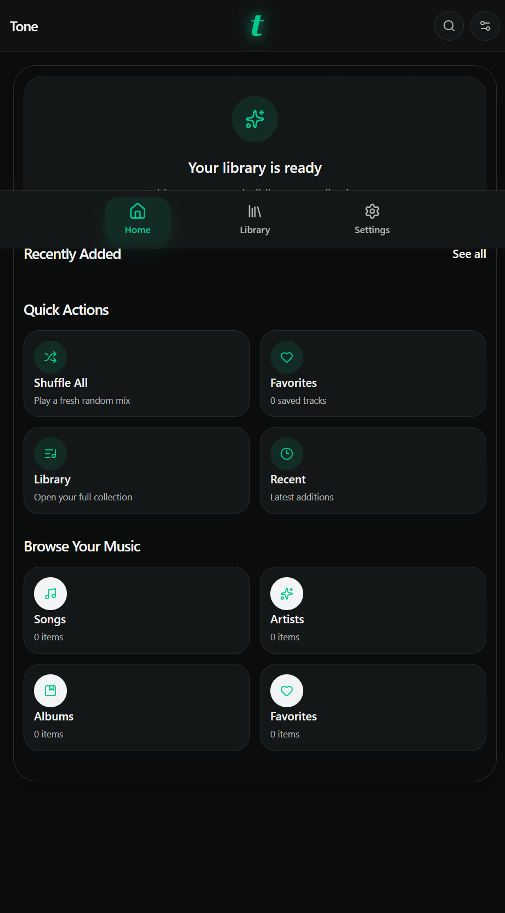
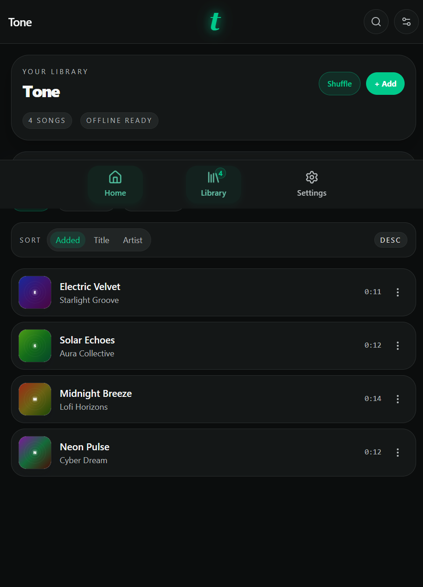
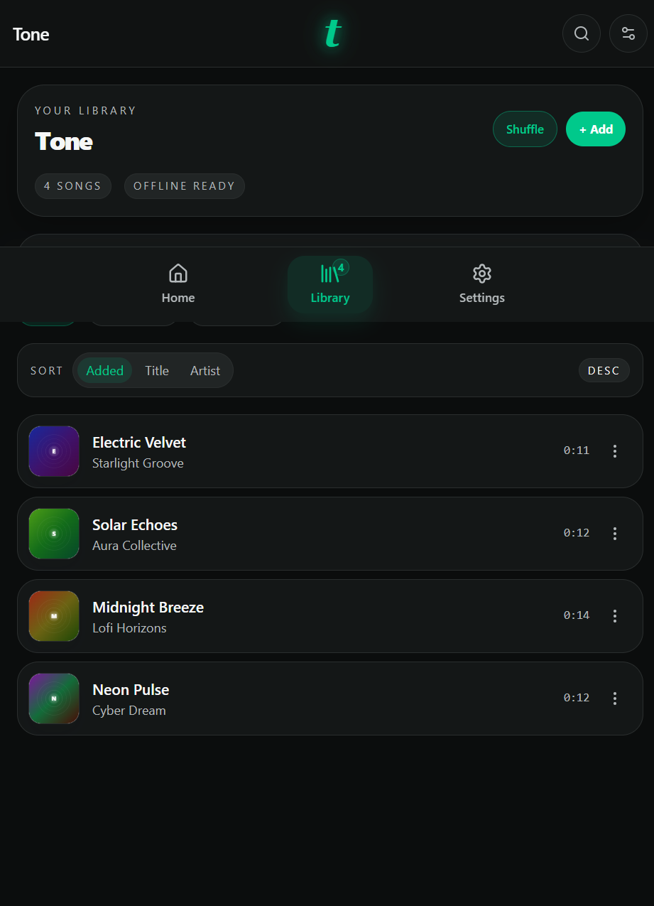
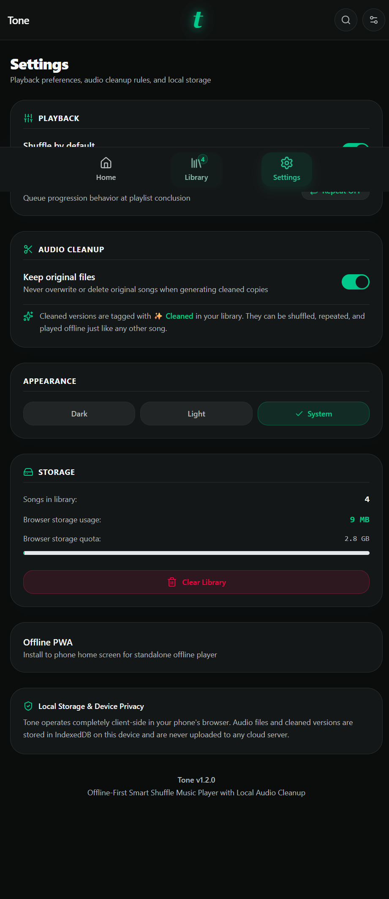
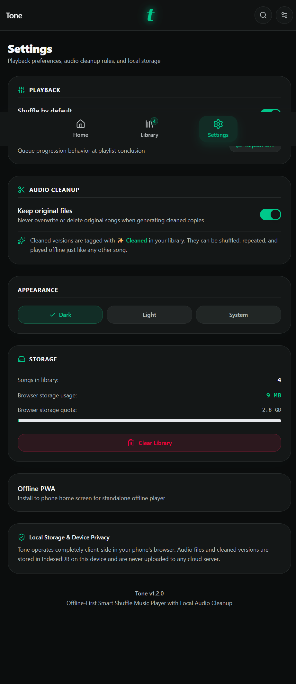

# Tone

### Your Music. Your Way.

> 🎵 Want to use Tone? Open the live app and install it as a PWA.

[▶ Open Tone](https://tone-music-player.vercel.app)

Tone is an offline-first local music player PWA for managing and playing your own music directly in the browser. It keeps your library on-device, supports offline playback, and helps you organize, search, clean, and enjoy the music you already own.

## Features

- Local music import
- Offline playback
- IndexedDB local storage
- Search
- Favorites
- Playlists
- Shuffle
- Repeat
- Automatic next-song playback
- Audio cleaning
- Auto Clean Start
- Waveform controls
- Album artwork
- Media Session
- PWA installation
- Offline functionality
- Light/Dark/System themes
- Responsive design
- Storage management

## Screenshots

### Home

### Player

### Library

### Search

### Settings

### Dark Mode

## Install Tone

Tone is a Progressive Web App (PWA), so users can open the live application and install it on supported devices.

1. Click "Open Tone".
2. The Tone application opens.
3. On a supported browser/device, use the browser's "Install app" option.
4. Install Tone.
5. Tone can then be launched like an app.

## About Tone

Tone was created as an offline-first music player focused on letting users manage and listen to their own local music. It is designed to keep everything on the device while still offering a polished, responsive interface for browsing, playing, and cleaning personal audio collections.

## Technology Stack

- React
- TypeScript
- Vite
- Tailwind CSS
- IndexedDB
- HTML5 Audio API
- Web Audio API
- Media Session API
- PWA

## Source Code

The Tone source code is available in this repository for project reference and development.
